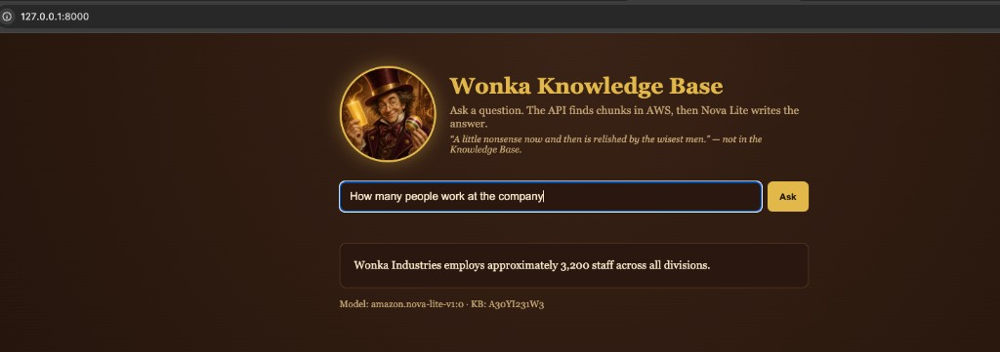
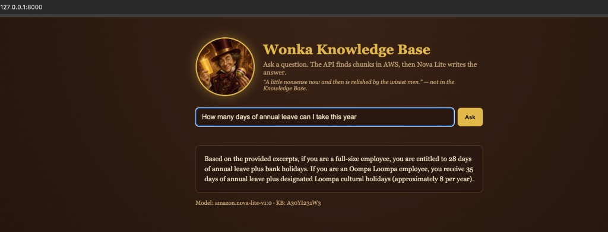
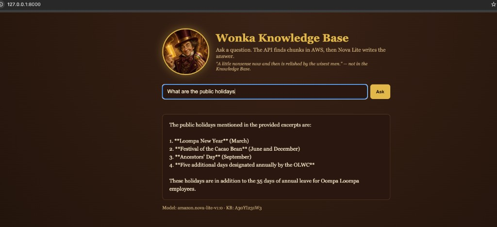
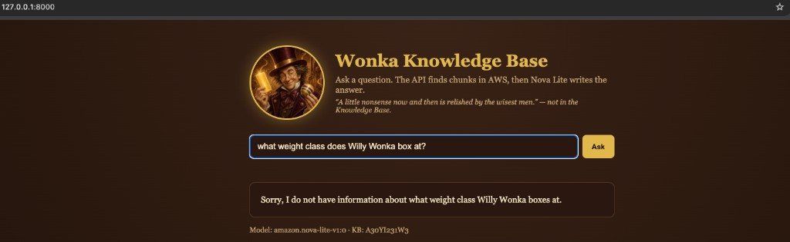

# Wonka Industries RAG

<p align="center">
  
</p>
<p align="center"><em>End to End RAG Project utilising Amazon Bedrock's managed Knowledge Base.</em></p>

A small end-to-end RAG project that uses **Amazon Bedrock’s managed Knowledge Base** instead of a homemade chunker and vector database. The goal was to show how in a production environment one could ingest from S3, chunked and vectorised by Knowledge base managed by AWS, and finally be queried from a thin FastAPI app.

The advantage of using a managed Knowledge Base is that one can focus on the retrieval and generation of the answer, while the underlying infrastructure is managed by AWS with the added benefit of being able to scale the infrastructure as needed whilst maintaining security and compliance..

I did not build OpenSearch, FAISS, or a splitting pipeline in for this repo. Bedrock Knowledge Base does the chunking, embeddings, and hybrid search. This app only **retrieves** from that service and asks **Amazon Nova Lite** to write an answer the user can read. Nova Lite was chosen as it is a cheap model that is great for prototype and development purposes.

```
S3 bucket  wonka-industries-rag-data   (source of truth)
        ↓  one-time ingest in AWS
Bedrock managed Knowledge Base A30YI231W3
        ↓  Retrieve (managed search)
FastAPI  →  Nova Lite (amazon.nova-lite-v1:0)
        ↓
Browser UI at http://127.0.0.1:8000/
```


## What was done

1. **Put a company corpus in S3.** Bucket `wonka-industries-rag-data` in `us-east-1` holds 29 markdown files. They are **synthetic** (Wonka is fictional) but they are written like the mix a real firm would dump into a shared drive: policies, board packs, product specs, incident reports, contracts, training.
2. **Let a managed service index them.** A Bedrock “quick start” Knowledge Base ingested that bucket. AWS owns chunking, embeddings, and retrieval. 
3. **Query that index from Python.** `scripts/s3_sync.py` can list or copy objects; `src/rag.py` calls `Retrieve` with `managedSearchConfiguration` (required for a managed KB), then `Converse` on Nova Lite.
4. **Wrap it in FastAPI.** A local UI at `/` asks a question; `/ask` returns JSON. Same path as the CLI (`scripts/ask_kb.py`).

## The S3 corpus: synthetic, but company-shaped

None of this is real Wonka Industries data. It is a **made-up but realistic** intranet: named roles, document IDs, dates, “CONFIDENTIAL” markings, and facts that **repeat across files** (headcount 3,200, founded 1962) the way a real handbook, annual report, and board minutes would overlap.

That overlap is deliberate. A managed RAG system should find the right *kind* of document (precision) and, when a number lives in more than one place, not miss the extras (recall). A single Wikipedia-style page would not test that.

### People, HR, and how the company is run

| Document | Why it is in the bucket |
|---|---|
| `employee_handbook.md` | The “front door” doc. Welcome, values, hours, leave, headcount. Typical first hit for “who are we / how many staff”. |
| `org_structure.md` | Roles, reporting lines, start years. Answers “who is Willy Wonka” without mixing in product lore. |
| `onboarding_guide.md` | Day-one process. Shorter, procedural, different tone from the handbook. |
| `oompa_loompa_employment_framework.md` | A second employment regime (shifts, leave, history since 1962). Real companies have parallel contracts; RAG has to keep them distinct. |
| `expense_policy.md` | Everyday finance rules. Low drama, high volume of the sort staff actually search. |
| `whistleblower_policy.md` | Ethics / legal. Tests retrieval on policy language, not story. |

### Board, numbers, and strategy

| Document |
|---|---|
| `board_minutes_q3_2023.md` / `board_minutes_q4_2023.md` | Time-stamped decisions and the same 3,200 headcount. Minutes are messy and specific — the opposite of a polished handbook. |
| `annual_report_summary_2023.md` | Revenue mix, geography, year-on-year employees (2,950 → 3,200). A second source for the same KPI. |
| `marketing_plan_2024.md` | Forward-looking commercial plan (budget, Japan launch). Strategy vs historical report. |
| `sustainability_report_2023.md` | ESG-style narrative. Another “official” voice, useful for “what do we claim about cocoa / sourcing”. |

### Product, R&D, and quality

| Document |
|---|---|
| `product_spec_everlasting_gobstopper.md` | Flagship SKU, layers, Compound WX-77, who knows the formula. Dense technical spec — classic “search my product bible”. |
| `product_spec_fizzy_lifting_drinks.md` / `product_spec_three_course_gum.md` | More SKUs so retrieval must pick the *right* product, not a generic sweets answer. |
| `rd_memo_television_chocolate.md` | Internal R&D memo, not a customer spec. Different audience and confidentiality. |
| `quality_control_procedures.md` | Inspection points, QC headcount. Operations, not marketing. |
| `supplier_agreement_cocoa.md` | Contract summary (volumes, dates, Abidjan cooperative). Legal/commercial RAG, not a wiki page. |

### Safety, incidents, and the factory floor

| Document | 
|---|---|
| `health_and_safety_policy.md` / `emergency_evacuation_plan.md` | What *should* happen. Procedures vs the incident write-ups below. |
| `incident_report_001_gloop.md` / `_002_beauregarde.md` / `_003_salt.md` | What *did* happen (factory-tour mishaps). Narrative, named people, dates. RAG should not confuse a 2005 incident with current policy. |
| `complaint_response_teavee.md` | Legal letter to a family. Same tour, different document type (outbound correspondence). |
| `factory_tour_guidelines.md` / `training_manual_chocolate_room.md` | How staff are told to run tours and the Chocolate Room. Complements incidents: rulebook vs after-action. |
| `glass_elevator_maintenance_log.md` | Semi-structured log (asset, manufacturer, dates). Not prose policy — a different retrieval shape. |

### Security and risk

| Document | 
|---|---|
| `it_security_policy.md` | Vault, biometrics, classified recipes. Typical IT policy corpus. |
| `security_report_slugworth_2019.md` | Named espionage incident around WX-77. Cross-links the gobstopper spec to a security file — **context recall** if you ask about Slugworth or the formula. |
| `memo_golden_ticket_anniversary.md` | Internal comms / history. Lighter tone, still in-corpus. |

About 29 objects in S3, all markdown, all fake, all in the shape of SharePoint-or-S3 company dump: **policies, minutes, specs, incidents, contracts, training**. That mix is the experiment. A managed Knowledge Base has to search across those types; Nova Lite has to answer only from what came back — including saying it does not know.

## What you see in the UI

The header portrait is the same Wonka illustration as at the top of this README. The questions below are the live app at `http://127.0.0.1:8000/`.









## Why Nova Lite (and RAGAS)

The **question / answer** step uses Nova Lite on purpose.  For a small managed-KB demo, a cheap writer is enough: RAGAS is scoring whether the answer **stuck to retrieved chunks**, **addressed the question**, and whether retrieval **picked the right documents** — not whether the prose sounds like a frontier model.

If Nova Lite stays faithful on in-corpus HR facts and refuses out-of-corpus nonsense, the pipeline is testable. Spending more on the writer would not fix a bad retrieve.

## Evaluating answers with RAGAS

The standard framework for this is **RAGAS**. It scores a RAG system on four metrics:

| Metric | Question it asks |
|---|---|
| **Faithfulness** | Did the answer stick to the retrieved context? |
| **Answer relevance** | Did it actually address the question? |
| **Context precision** | Did retrieval find the *right* chunks? |
| **Context recall** | Did it find *all* the relevant chunks? |

These UI tests map onto that:

**1. “How many people work at the company”** — grounded fact.  
“Approximately 3,200 staff across all divisions” is in `employee_handbook.md` (and again in board minutes / the annual report). High **faithfulness** and **answer relevance**. Hitting the handbook is **context precision**; **context recall** is only complete if the other 3,200 mentions came back too.

**2. “How many days of annual leave can I take this year”** — two regimes, one question.  
Nova Lite split **28 days + bank holidays** (full-size staff) vs **35 days + Loompa cultural holidays** (Oompa Loompa framework). That is the handbook *and* `oompa_loompa_employment_framework.md`. Strong **answer relevance** (it did not pick only one contract) and a **context recall** win: both employment docs matter.

**3. “What are the public holidays”** — the parallel calendar.  
Loompa New Year, Festival of the Cacao Bean, Ancestors’ Day, plus OLWC-designated days, sit in the Oompa Loompa framework. Faithful to that file; it did not invent UK bank-holiday names that are not listed there.

**4. “What weight class does Willy Wonka box at?”** — hallucination check.  
Nothing in the corpus is about boxing. The model said it does not have that information. That is the **faithfulness** behaviour we want: cheaper Nova Lite still refused to invent a division. **Answer relevance** holds because it addressed the question by saying the KB does not contain it.

Together: Nova Lite is cheap enough to run these checks often, and still good enough for RAGAS — it answers from Wonka docs when the facts are there, and it does not hallucinate when they are not.

## 1. Activate the environment

This project uses a conda env at `.venv` (not a `venv` activate script):

```bash
conda activate /Users/HanifDS/Documents/AIProjects/RAGProject/WillieWonka/.venv
```

From the project root you can also use:

```bash
conda activate "$(pwd)/.venv"
```

Cursor should also pick up `.venv` automatically.

## 2. Add your API keys

Copy values into `.env` (already created, gitignored):

- **AWS / boto3** — fill `AWS_ACCESS_KEY_ID` and `AWS_SECRET_ACCESS_KEY`, **or** leave them blank and use `~/.aws/credentials`
- Sandbox IAM is used for S3 and Knowledge Base Retrieve
- Generation model is `amazon.nova-lite-v1:0`

Then confirm everything loads:

```bash
python scripts/check_setup.py
```

## 3. S3 source documents

The project bucket is `wonka-industries-rag-data` in `us-east-1`. S3 uses IAM, not the Bedrock API key.

```bash
python scripts/s3_sync.py              # list objects
python scripts/s3_sync.py --download   # copy into data/raw/
```

## 4. Run the app

CLI:

```bash
python scripts/ask_kb.py "What is the everlasting gobstopper?"
python scripts/ask_kb.py --chunks "What is the everlasting gobstopper?"
```

API + webpage:

```bash
uvicorn src.api:app --reload --host 127.0.0.1 --port 8000
```

Open http://127.0.0.1:8000/ for the UI.

`/ask?q=...` returns raw JSON (for programs, not a page). Interactive API docs: http://127.0.0.1:8000/docs

```bash
curl -X POST http://127.0.0.1:8000/ask \
  -H "Content-Type: application/json" \
  -d '{"question":"What is the everlasting gobstopper?"}'
```
